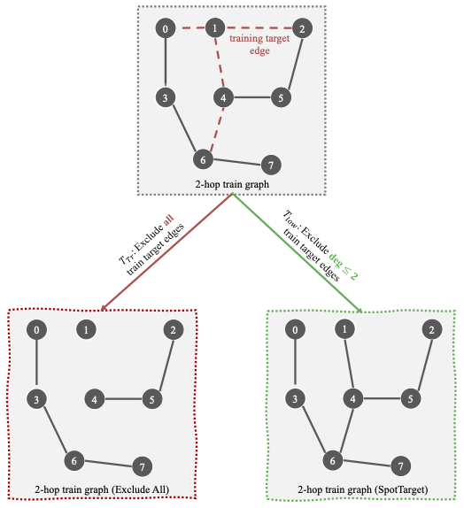

# [RFC] Edge sampler with excluding edges adjacent to low-degree nodes
## 🚀 Feature
This issue is for extending the function of excluding the training edges in the edge sampler used in the link prediction training. 
We develop a new edge prediction sampler `EdgePredictionSamplerwithDegree` based on `dgl.dataloading.as_edge_prediction_sampler`.
Besides the function to exclude all the training edges in the original sampler, our new edge sampler can exclude the training edges only adjacent to the low-degree nodes. 
Experimental Implementation is here.
## Motivation
For the GNN training on link prediction task, the existence of training target edges during message passing leads to the overfitting issue.
When this edge is not excluded from the training graph, 
GNNs would use the message passing graph 
and look up the existence of training edges in the message passing graph instead of learning to predict it based on the graph structure and node features.

In the test process, GNNs may still directly search from the message passing graph to determine the test edge existence. If test edges are excluded from the graph, it will cause influence the test performance and lead to the overfitting issue.

The intuitive solution to avoid the training overfitting issue is to exclude all the training edges which has been implemented in `dgl.dataloading.as_edge_prediction_sampler`, but this exposes several challenges.
1. Excluding all target edges cannot be done in full batch training setting, since in full batch training, excluding all training edges is equivalent to excluding all edges in the graph
2. We found that in the mini-batch setting, it causes too much distraction for mini-batch graphs.
3. Setting the batch size to be 1 can solve the structure distraction problem, the mini-batch message passing graph will be too small. As a result, the training will be unstable and computationally inefficient.

An Example of 2-hop message passing graph for a mini-batch of size 4 is shown below:



The red lines are training edges and the black lines are other message passing edges induced by the edges. 
As shown on the left, if all training edges are excluded during training, it results in three disconnected components 
and one of them is an isolated node. But if only training edges incident to low-degree nodes are excluded, as shown on the right, the train graph is still connected. 
There is not much distraction to the graph structure while taking the benefit of avoiding the overfitting issue.

Developing an edge sampler which can provide the users to only exclude a proportion of training edges can benefit the overall training process. 
Our experimental results below can also our edge sampler's superiority over the existing `dgl.dataloading.as_edge_prediction_sampler`.
## Alternatives
There is currently no alternatives in DGL to only removing the training edges adjacent to low-degree nodes outlined above.
## Pitch
The user experience will look like the following:
```python
sampler = NeighborSampler([15, 10, 5], prefetch_node_feats=['feat'])
exclude_target_degree = ... 
# -1 means remove all training edges
# 0 means do not remove training edges 
# positive numbers means remove edges incident to the nodes with degrees less than exclude_target_degree
if exclude_target_degree == -1:
    edge_sampler = as_edge_prediction_sampler(sampler, exclude="reverse_id", reverse_eids=reverse_eids, 
                                            negative_sampler=negative_sampler.Uniform(1))
elif exclude_target_degree > 0:
    edge_sampler = EdgePredictionSamplerwithDegree(sampler, exclude="reverse_id", reverse_eids=reverse_eids,
                                              negative_sampler=negative_sampler.Uniform(1),
                                              degree_threshold=exclude_target_degree)
elif exclude_target_degree == 0:
    edge_sampler = as_edge_prediction_sampler(sampler, reverse_eids=reverse_eids, 
                                            negative_sampler=negative_sampler.Uniform(1))
```
If users do not exclude training edges or exclude all training edges, they can use the original `as_edge_prediction_sampler`. 
If users need to remove edges incident to low-degree nodes, they can use our `EdgePredictionSamplerwithDegree`.

We achieve the function of excluding a proportion of training edges by only applying `dgl.dataloading.base._find_exclude_eids` function to the edges incident to low-degree nodes. 
## Additional context


## API and usage scenarios
Our edge sampler `EdgePredictionSamplerwithDegree` inherits from `dgl.dataloading.base.EdgePredictionSampler`. 
We add a new argument `degree_threshold` with the default value 10. 
The sampler will automatically remove the training edges incident to at least one low-degree node lower than the `degree_threshold`.
The other functions of `EdgePredictionSamplerwithDegree` are the same as `dgl.dataloading.as_edge_prediction_sampler`, 
so the usage scenarios of two edge samplers are almost the same. 
If the users need to exclude the edges incident to low-degree nodes, our new edge sampler can directly replace `as_edge_prediction_sampler` by adding the argument `degree_threshold`. 
 

## Experimental results
We select four common GNN models to validate our framework. SAGE, GCN and GATv2 are GAE-based models. 
SEAL is a subgraph-based model that extracts an enclosing subgraph for each target edge and then predicts the link likelihood based on the subgraph's embeddings. 

Besides our edge sampler which only excludes training edges adjacent to low-degree nodes (`ExcludeLow`), we use `ExcludeNone` and `ExcludeAll` as our baselines. 
`ExcludeNone` does not exclude any training edges, and `ExcludeAll` exclude all training edges.

Throughout the experiments, we use the numbers of training batch size 
for `Ogbl-collab`, `Ogbl-citation2`, and `USAir` is set to 256, 1024, and 64, respectively.
 
For SAGE models, the learning rate is 5e-4, the dimension of hidden layers is 256, and the number of hidden layers is 3. For GCN, the number of hidden layers is 1 and others remain the same as the SAGE. 
For GATv2, the number of heads is 8, the learning rate is 5e-4, the dimension of hidden layers is 64. 
For SEAL, the learning rate is 1e-4, the number of hops is 1, the training percent is 15%, 2% and 100% and 
the dimension of hidden layers is is 256, 256 and 32 for `Ogbl-collab`, `Ogbl-citation2`, and `USAir` respectively.

We used a single Nvidia A40 GPU to train the model and repeat our experiments with three different random seeds.

| Model | ExcludeNone      |     ExcludeAll    |    ExcludeLow    |
|-------|----------------------|:-----------------:|:----------------:|
|       |  Ogbl-Collab (H@50)  |                   |                  |
| SAGE  | 48.57 ± 0.74     |  45.82 ± 0.41 | 49.00 ± 0.65 |
| GCN   | 43.03 ± 0.50     |  37.75 ± 1.42 | 39.58 ± 1.06 |
| GATv2 | 45.61 ± 0.85     |  45.71 ± 0.87 | 45.46 ± 0.19 |
| SEAL  | 61.27 ± 0.28     |  64.11 ± 0.30 | 64.57 ± 0.30 |
|       | Ogbl-Citation2 (MRR) |                   |                  |
| SAGE  | 82.06 ± 0.06     |  81.47 ± 0.17 | 82.18 ± 0.18 |
| GCN   | 79.70 ± 0.25     |  79.06 ± 0.30 | 79.88 ± 0.14 |
| GATv2 | OOM                  |        OOM        |        OOM       |
| SEAL  | 86.75 ± 0.20     |  86.74 ± 0.23 | 86.93 ± 0.55 |
|       |      USAir (AUC)     |                   |                  |
| SAGE  | 95.97 ± 0.17     |  95.71 ± 0.12 | 96.19 ± 0.53 |
| GCN   | 94.00 ± 0.14     |  94.09 ± 0.11 | 94.28 ± 0.15 |
| GATv2 | 95.05 ± 0.66     | 95.66  ± 0.24 | 95.87 ± 0.46 |
| SEAL  | 95.36 ± 0.24     |  95.94 ± 0.04 | 96.39 ± 0.09 |
| Rank  | 2.27     |  2.45 | 1.27 |

The results indicate that `ExcludeLow` can achieve the best average results
and the lowest rank compared with `ExcludeNone` (not excluding training edges) and `ExcludeAll` (excluding all training edges).
